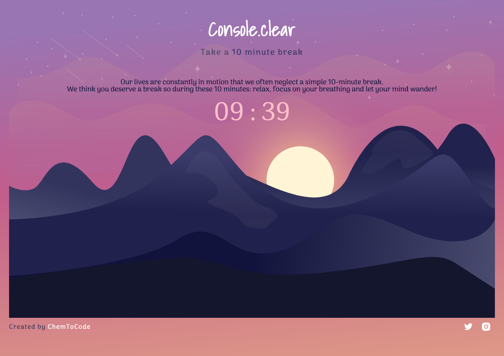

    

<h1 align="center" >
  <i><u>Console.clear</u></i>
</h1>

<h2 align="center">
  <i>Console.clear is a project for the <a href="https://www.dev.to">Dev.to</a> DigitalOcean App Platform Hackathon in the category: Program for the People!</i>
</h2>

<h3 align="center" >
  <i><u>Desktop Version</u></i>
</h3>

<h3 align="center" >
  <i><u>Mobile Version</u></i>
</h3>

<h2>
  <i><u>About Project: </u></i>
</h2>

<h3>The project idea has been brewing for a while as I really wanted to do create an app around mental health, knowing it would help others but most importantly, it was something that I could benefit from as well. The idea for console.clear came from browsing MDN one day and coming across it and it was only recently official! There were many ideas for this project but because of the deadline (and the fact I started coding properly three days ago! The current app has a 10-minute break timer for anyone to access and take a break from the chaos of the world!</h3>

<h2>
  <i><u>Tech Used: </u></i>
</h2>

- 
Gatsbyjs

- 
React Hooks

- 
Styled Components

- 
GSAP for animations

- 
Affinity Designer

- 
Figma

<h2>
  <i><u>License: </u></i>
</h2>

Apache 2.0 with Commons Clause

<h2>
  <i><u>Author: IkraP </u></i>
</h2>
